[[E3DSpec]]
== E3D 3D Model Format Specification

NOTE: The latest version of this specification is maintained at https://github.com/ecere/E3D-spec

=== Coordinate system
The coordinate system for E3D models is left-handed:

- x is positive to the right
- y is positive up
- z is positive going away into the distance

=== A simple cube example

[reftext='{figure-caption} {counter:figure-num}']
.cube1.e3d (468 bytes)
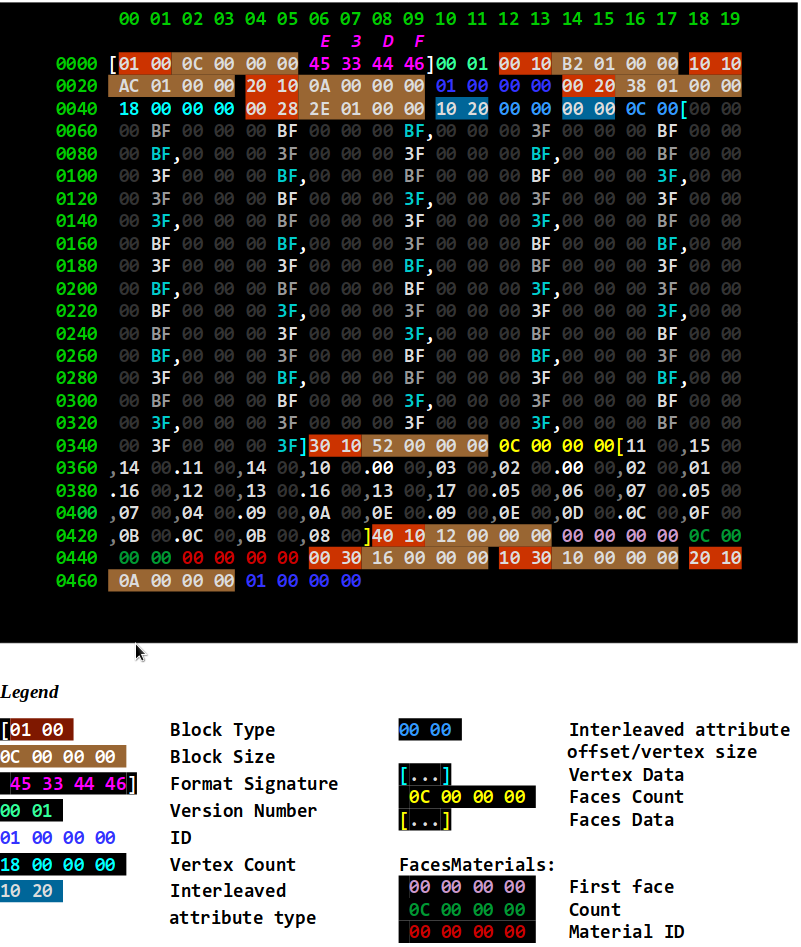

*_Little-endian throughout (least significant bytes first)_*

[reftext='{table-caption} {counter:table-num}']
.Example E3D encoding of a simple cube
|===
|Offset |Block Type |Block Length |Contents |Description

|0
|0x0001 *_(Version)_*
|0x0000000C (12) +
bytes [0..11]
|E3DF 0x0100 (1, 0)
|E3D Version 1.0

|12
|0x1000 (Meshes)
|0x000001B2 (434) +
bytes [12..445]
|sub-blocks: Mesh
|1 mesh in this file

|18
|► 0x1010 (Mesh)
|0x000001AC (428) +
bytes [18..445]
|sub-blocks: MeshID, Attributes,  TriFaces16, FacesMaterials
|Mesh description

|24
|►►0x1020   (MeshID)
|0x0000000A (10) +
bytes [24..33]
|0x00000001
|Mesh ID: 1

|34
|►► 0x2000 (Attributes)
|0x00000138 (312) +
bytes [34..345]
|0x00000018 (24) +
sub-blocks: Interleaved
|24 vertices, interleaved attributes for each vertex

|44
|►►► 0x2800 (Interleaved)
|0x0000012E (302) +
bytes [44..345]
|0x2010 (Vertices) +
0x0000 (0) 0x0000 (0) 0x000C (12) +
[...vertex data...] (24 vertices)
|The interleaved attributes contain only (x,y,z) 32-bit floating-point vertices at offset 0 (0 type ends list of attribute types); for a total of 12 bytes per vertex.

|58
|Vertex data
|(288 bytes)
bytes [58..402]
|BF000000,BF000000,BF000000, +
3F000000,BF000000,BF000000, +
3F000000,3F000000,BF000000, +
BF000000,3F000000,BF000000, +
BF000000,BF000000,3F000000, +
3F000000,BF000000,3F000000, +
3F000000,3F000000,3F000000, +
BF000000,3F000000,3F000000, +
 +
BF000000,BF000000,BF000000, +
3F000000,BF000000,BF000000, +
3F000000,3F000000,BF000000, +
BF000000,3F000000,BF000000, +
BF000000,BF000000,3F000000, +
3F000000,BF000000,3F000000, +
3F000000,3F000000,3F000000, +
BF000000,3F000000,3F000000, +
 +
BF000000,BF000000,BF000000, +
3F000000,BF000000,BF000000, +
3F000000,3F000000,BF000000, +
BF000000,3F000000,BF000000, +
BF000000,BF000000,3F000000, +
3F000000,BF000000,3F000000, +
3F000000,3F000000,3F000000, +
BF000000,3F000000, 3F000000,
|{-0.5,-0.5,-0.5 }, +
{ 0.5,-0.5,-0.5 }, +
{ 0.5, 0.5,-0.5 }, +
{-0.5, 0.5,-0.5 }, +
{-0.5,-0.5, 0.5 }, +
{ 0.5,-0.5, 0.5 }, +
{ 0.5, 0.5, 0.5 }, +
{-0.5, 0.5, 0.5 }, +
 +
{-0.5,-0.5,-0.5 }, +
{ 0.5,-0.5,-0.5 }, +
{ 0.5, 0.5,-0.5 }, +
{-0.5, 0.5,-0.5 }, +
{-0.5,-0.5, 0.5 }, +
{ 0.5,-0.5, 0.5 }, +
{ 0.5, 0.5, 0.5 }, +
{-0.5, 0.5, 0.5 }, +
 +
{-0.5,-0.5,-0.5 }, +
{ 0.5,-0.5,-0.5 }, +
{ 0.5, 0.5,-0.5 }, +
{-0.5, 0.5,-0.5 }, +
{-0.5,-0.5, 0.5 }, +
{ 0.5,-0.5, 0.5 }, +
{ 0.5, 0.5, 0.5 }, +
{-0.5, 0.5, 0.5 }

5+|Although a cube only has 8 vertices, this cube describes 24 vertices so as to be ready for adding additional attributes such as normals, which will differ depending on which face it is being referenced by (because a cube has faces at a square angle and the normals pointing away from the faces are very different therefore not averaged at the shared vertices / corners).

|346
|► 0x1030 (TriFaces16)
|0x00000052 (82) +
bytes [346..427]
|0x0000000C (12) +
[...16-bit tri indices...]
|Count of 12 triangle faces described as triplets of indices into attributes +
(12 faces, 36 indices)

|356
|Faces data
|(72 bytes) +
bytes [356..427]
|0x11, 0x15, 0x14, +
0x11, 0x14, 0x10, +
0x00, 0x03, 0x02, +
0x00, 0x02, 0x01, +
0x16, 0x12, 0x13, +
0x16, 0x13, 0x17, +
0x05, 0x06, 0x07, +
0x05, 0x07, 0x04, +
0x09, 0x0A, 0x0E, +
0x09, 0x0E, 0x0D, +
0x0C, 0x0F, 0x0B, +
0x0C, 0x0B, 0x08
|{ 17, 21, 20 }, { 17,20, 16 }, +
{ 0, 3, 2 }, { 0, 2, 1 }, +
{ 22, 18, 19 }, { 22, 19, 23 }, +
{ 5, 6, 7 }, { 5, 7, 4 }, +
{ 9, 10, 14 }, { 9, 14, 13 }, +
{ 12, 15, 11 }, { 12, 11, 8 } +
(2 triangles per cube square faces)

|428
|► 0x1040 +
(Faces Materials)
|0x00000012 (18) +
bytes [428..445]
|0x00000000 (0) +
0x0000000C (12) +
0x00000000 (0)
|First face: 0 (indices: × 3) +
Faces count: 0 (indices: × 3) +
Material ID: 0 (none)

|446
|0x3000 (Nodes)
|0x00000016 (22) +
bytes [446..467]
|sub-blocks: MeshNode
|1 node in this file +
(instance of a mesh)

|452
|► 0x3010 (MeshNode)
|0x00000010 (16) +
bytes [452..467]
|sub-blocks: MeshID
|This node references a mesh in the meshes list by ID. +
Because no transformation is specified, the defaults apply: (1,1,1) scaling; (0,0,0) offset;
(w=1,0,0,0) quaternion orientation

|458
|►► 0x1020 (MeshID)
|0x0000000A (10)
|0x00000001 (1)
|This references mesh ID 1.
|===

[reftext='{figure-caption} {counter:figure-num}']
.cube1.e3d
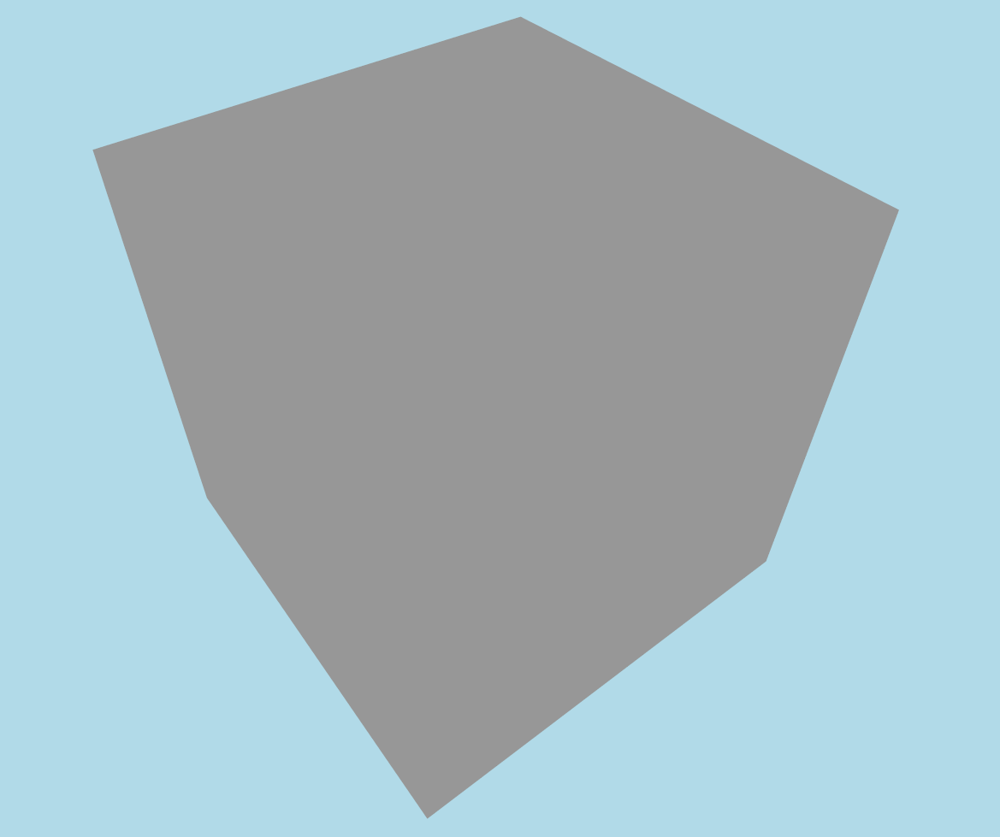

=== Adding normals attributes
This version adds normals to the interleaved attributes (with x,y,z packed using 10 bits each).

[reftext='{figure-caption} {counter:figure-num}']
.cube2.e3d (568 bytes) -- A cube with normals
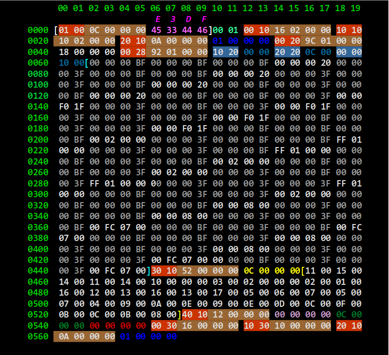

{empty} +
The floating-point normal values for the normals are (0 is implied for non-specified component values):

{ z = -1.0 }, { z = -1.0 }, { z = -1.0 }, { z = -1.0 },

{ z =  1.0 }, { z =  1.0 }, { z =  1.0 }, { z =  1.0 },

{ x = -1.0 }, { x =  1.0 }, { x =  1.0 }, { x = -1.0 },

{ x = -1.0 }, { x =  1.0 }, { x =  1.0 }, { x = -1.0 },

{ y = -1.0 }, { y = -1.0 }, { y =  1.0 }, { y =  1.0 },

{ y = -1.0 }, { y = -1.0 }, { y  = 1.0 }, { y =  1.0 }

[reftext='{figure-caption} {counter:figure-num}']
.cube2.e3d & cube3.e3d
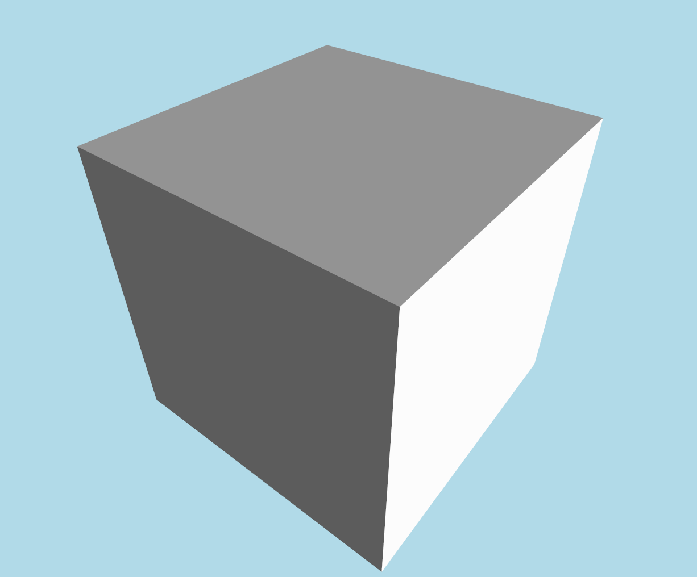

=== Compression

This version compresses the data using LZMA (any series of blocks, except the version header block, can be compressed inside an LZMA block). Here the top blocks are compressed in one LZMA block.

[reftext='{figure-caption} {counter:figure-num}']
.cube3.e3d (201 bytes) -- compressed with LZMA.
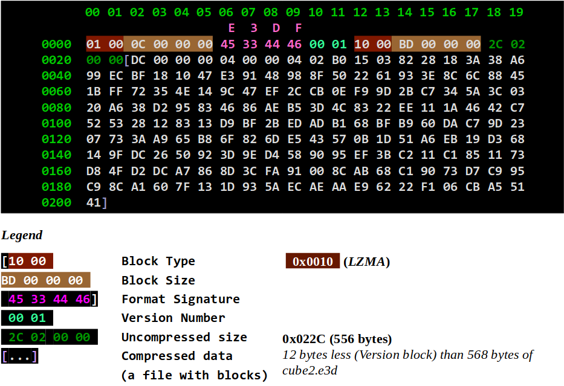

=== Detailed description of all block types

[reftext='{table-caption} {counter:table-num}']
.Detailed description of all E3D block types
|===
|Block Type |Value |Description

|version
|0x0001
|uint16: major (high), minor (low)

|lzma
|0x0010
|size: uint16, compressed data +
Compression can be applied done at any block-level.

|*meshes*
|*0x1000*
|Section to describe meshes.

|►mesh
|0x1010
|Describe a single mesh with a unique set of attributes.

|►►meshID
|0x1020
|(uint) Defines (within mesh) or refers to (within meshNode) a unique ID for the mesh.

|►►meshBBox
|0x1021
|float: loX, loY, loZ, hiX, hiY, hiZ

|►►meshDuplicateVertices
|0x1022
|(uint) count; count * 16-bit index of original vertex corresponding to this vertex (e.g., for different normal / texCoord)

|►►attributes
|0x2000
|uint count (limit of 65,536 vertices, multiple meshes should be used for more); +
one interleaved and/or multiple attributes sub-blocks.

|►►►vertices
|0x2010
|3x (x,y,z) 32-bit floats

|►►►verticesDbl
|0x2011
|3x (x,y,z) 64-bit doubles

|►►►verticesQ
|0x2018
|3x (x,y,z) 16-bit signed integer (quantized to meshBBox)

|►►►normals
|0x2020
|3 components (x,y,z) stored as signed https://www.khronos.org/registry/OpenGL/extensions/ARB/ARB_vertex_type_2_10_10_10_rev.txt[10_10_10_2] format (10 bits per component: -1..1 range mapped to -511..511)

|►►►texCoords
|0x2030
|Texture coordinates -- 2 components (u,v) as 32-bit floats ranging from 0..1 for covering the entire texture (beyond that range for tiling)

|►►►texCoords2
|0x2031
|Second set of texture coordinates -- 2 components (u,v) as 32-bit floats ranging from 0..1

|►►►texCoords3
|0x2032
|Third set of texture coordinates -- 2 components (u,v) as 32-bit floats ranging from 0..1

|►►►texCoords4
|0x2033
|Fourth set of texture coordinates -- 2 components (u,v) as 32-bit floats ranging from 0..1

|►►►texCoords5
|0x2034
|Fifth set of texture coordinates -- 2 components (u,v) as 32-bit floats ranging from 0..1

|►►►texCoords6
|0x2035
|Sixth set of texture coordinates -- 2 components (u,v) as 32-bit floats ranging from 0..1

|►►►texCoords7
|0x2036
|Seventh set of texture coordinates -- 2 components (u,v) as 32-bit floats ranging from 0..1

|►►►texCoords8
|0x2037
|Eighth set of texture coordinates -- 2 components (u,v) as 32-bit floats ranging from 0..1

|►►►colors
|0x2070
|4 components (r,g,b,a) as 8-bit integers (0..1 range mapped to 0..255)

|►►►tangentsSign
|0x2080
|Tangents as 3 signed components (x,y,z) in https://www.khronos.org/registry/OpenGL/extensions/ARB/ARB_vertex_type_2_10_10_10_rev.txt[10_10_10_2] format (10 bits per component: -1..1 range mapped to -511..511), with the first extra bit used to indicate sign for re-constructing the co-tangent (orthogonal to normal and tangent)

|►►►tangentsBi
|0x2081
|Tangents and bi-tangents as 6 components 2x (x,y,z) signed https://www.khronos.org/registry/OpenGL/extensions/ARB/ARB_vertex_type_2_10_10_10_rev.txt[10_10_10_2] format (10 bits per component: -1..1 range mapped to -511..511)

|►►►boneWeights
|0x2090
|Skin bone ID and weights at each vertex (excluding as many last vertices as the duplicate vertices count) -- count * 1..255 byte bone ID (0 indicating no bone); count * 0..1 weight mapped to 0..255 (max number of bones implied from next offset increment)

|►►►boneWeights2..8
|0x2091..7
|Alternative skin bone ID and weights for additional skins

|►►►interleaved
|0x2800
|Define multiple attributes interleaved +
First a list of included attributes as: +
uint16 type, offset. +
0 (uint16) is used to end the list, followed by the total size of attributes per vertex (also uint16).

|►►►custom
|0x4000:0x5FFF
|Custom attributes definitions.

|►►triFaces16
|0x1030
|Triangles (3 indices per triangles -- each unsigned, 16-bit)

|►►triFaces32
|0x1031
|Triangles (3 indices per triangles -- each unsigned, 32-bit)

|►►facesMaterials
|0x1040
|Start triangle (uint), count of triangles (uint), material ID (uint) +
(this could be a reference to an external materials table, e.g. if description is omitted)

|►►skin
|0x1050
|Skinned bones definition

|►►►skinName
|0x1051
|(String) A name for the skin (optional)

|►►►skinBindMatrix
|0x1052
|Skin bind matrix to which bone definitions are relative -- 4x4 32-bit float

|►►►skinBones
|0x1053
|Bone definitions -- byte number of bones, for each bone: nodeName referencing a node; 4x4 32-bit float inverse bind matrix (relative to skin bind matrix)

|►►►skinBoneWeights
|0x1054
|byte 0..7: set of bone weights to use for this skin (default to 0 if not present)

|►►parts
|0x1060
|For each part: +
(uint) Part ID; (uint) Start triangle within triFaces list; (uint) Count of triangles +
For intra-model attribution. +
Attributes stored/queried separately in a database (or embedded as special block type).

|*nodes*
|*0x3000*
|Section to define nodes instancing meshes, cameras and lights.

|►meshNode
|0x3010
|A node to instance a mesh.

|►►nodeID
|0x3020
|(uint) Defines or refers to a node ID.

|►►nodeName
|0x3021
|(String) Defines or refers to a node name.

|►►scaling
|0x3030
|Defines scaling transformation for a node as +
3x (x,y,z) 32-bit float scale factors.

|►►orientation
|0x3031
|Defines orientation transformation for a node as +
a quaternion 4x (w,x,y,z) 64-bit doubles.

|►►position
|0x3032
|Defines translation transformation for a node as +
3x (x,y,z) 64-bit doubles.

|►►skeleton
|0x3040
|ID of root object node for skeleton (32-bit integer); skeleton name (string).

|►cameraNode
|0x3011
|Reserved for defining a camera.

|►lightNode
|0x3012
|Reserved for defining a light.

|*materials*
|*0x8000*
|Section to define materials.

|►material
|0x8010
|Describes the real-world appearance of this material in the scene. +
Both classic Phong shading model and Physically Based Rendering (PBR) properties can be specified. +
All properties are optional, defaulting to white non-textured.

|►►materialID
|0x8011
|(uint) Defines the ID for the material +
(referenced by FacesMaterials bock).

|►►materialName
|0x8012
|(String) Defines the name of the material.

|►►materialGroup
|0x8013
|(uint) An ID which can be used to regroup compatible materials where a given map (e.g. phongDiffuseMap) is of identical dimensions, allowing to leverage array textures. +
One material can then correspond to a layer of the array texture (e.g. the material ID could be used as the layer ID).

|►►materialFlags
|0x8020
|bit 0: double-sided _(default to true)_ ; +
bit 1: partly transparent (true if textures not entirely opaque) _(default to false)_  +
bit 2: translucent flag (true if textures contain siginificant semi-opaque portions) _(default to false)_ +
_The distinction between partly transparent and translucent will suggest very different approaches to handling transparency._ +
bit 3: wrapU: tile texture horizontally if set; clamp otherwise _(default to clamp)_  +
bit 4: wrapV: tile texture vertically if set; clamp otherwise _(default to clamp)_

|►►opacity
|0x8021
|(float) 1 meaning fully opaque (default); 0 fully transparent

|►►refractionRelIndex
|0x8022
|(float) Relative refraction index _(Default to 1.0)_ +
(refractive index / container refractive index) +
 _examples of refraction indices: +
vacuum : 1.0, glass: 1.5; water: 1.333_

|►►reflectivity
|0x8023
|(float) Reflectivity _(default to 0.0 -- non-reflective)_

|►►phongShininess
|0x8024
|(float) Shininess (Phong Model exponent: sharpness of specular highlight)

|►►diffuse
|0x8030
|3 floats (r,g,b) Diffuse _(default to white)_

|►►specular
|0x8031
|3 floats (r,g,b) Specular _(default to diffuse color or white)_

|►►emissive
|0x8032
|3 floats (r,g,b) Emissive _(default to black -- non-emissive)_

|►►ambient
|0x8034
|3 floats (r,g,b) Ambient _(default to diffuse color or white)_

|►►emissiveMap
|0x8100
|Emissive map +
(reference to a sharable texture via a textureID sub-block)

|►►normalMap
|0x8101
|Normal map +
(reference to a sharable texture via a textureID sub-block)

|►►heightMap
|0x8102
|Height displacement map +
(reference to a sharable texture via a textureID sub-block)

|►►ambientOcclusionMap
|0x8103
|Ambient occlusion map +
(reference to a sharable texture via a textureID sub-block)

|►►phongDiffuseMap
|0x8200
|Diffuse & opacity map +
(reference to a sharable texture via a textureID sub-block)

|►►phongSpecularMap
|0x8201
|Specular map +
(reference to a sharable texture via a textureID sub-block)

|►►phongAmbientMap
|0x8202
|Ambient map +
(reference to a sharable texture via a textureID sub-block)

|►►pbrRMAlbedo
|0x8300
|Albedo texture for Roughness/Metalness PBR model +
(reference to a sharable texture via a textureID sub-block)

|►►pbrRMRoughnessMetalness
|0x8301
|Roughness/Metalness texture for Roughness/Metalness PBR model +
(reference to a sharable texture via a textureID sub-block)

|►►pbrSpecDiffuseMap
|0x8400
|Diffuse Map for Specular/Glossiness PBR model +
(reference to a sharable texture via a textureID sub-block)

|►►pbrSpecSpecularGlossMap
|0x8401
|Specular/Glossiness Map for Specular PBR model +
(reference to a sharable texture via a textureID sub-block)

|*textures*
|*0x9000*
|Section to define textures.

|►texture
|0x9001
|Definition of a single texture.

|►►textureID
|0x9002
|Defines or refers to a sharable texture using a unique ID.

|►►textureName
|0x9003
|(String) Defines or refers to a sharable texture by name.

|►►texturePNG
|0x9101
|Embeds a PNG-encoded texture.

|►►textureJPG
|0x9102
|Embeds a JPEG-encoded texture.

|►►textureJPG2K
|0x9103
|Embeds a JPEG2000-encoded texture.

|*animations*
|*0xA000*
|Section to define animations.

|►animation
|0xA010
|Define an animation

|►►animationName
|0xA021
|(String) Name for animation (optional)

|►►animationFrames
|0xA022
|(uint) Start, end and default frame for animation

|►►animationTrack
|0xA100
|An animation frame track -- (uint) number of keys; number of keys * (uint) frameNumber; 1-byte bool looping flag; TCBEase and Frame Track Key sub-blocks; nodeID and/or nodeName reference sub-blocks

|►►►frameTCBEase
|0xA110
|(optional) Tension, continuity, bias and easeFrom / easeTo for each key: 32-bit floats

|►►►ftkRotationOrder
|0xA120
|(optional) Rotation Order for combining ftkRotationYaw, ftkRotationPitch, ftkRotationRoll; 0: xyz, 1: xzy, 2: yxz, 3: yzx, 4: zxy, 5: zyx (default: zxy)

|►►►ftkPosition
|0xA210
|Translation -- 3 (x,y,z) float positions per key

|►►►ftkScaling
|0xA220
|Scaling -- 3 (x,y,z) float scaling per key

|►►►ftkRotation
|0xA230
|Rotation -- 4 (w,x,y,z) float quaternion orientation per key

|►►►ftkRotationYaw
|0xA240
|Yaw rotation -- float yaw orientation (in degrees) per key

|►►►ftkRotationPitch
|0xA250
|Pitch rotation -- float pitch orientation (in degrees) per key

|►►►ftkRotationRoll
|0xA260
|Roll rotation -- float roll orientation (in degrees) per key

|►►►ftkCameraFieldOfView
|0xA270
|Camera field of view -- float camera field of view (in degrees) per key

|►►►ftkCameraRoll
|0xA280
|Camera roll -- float camera roll (in degrees) per key

|►►►ftkLightHotSpot
|0xA290
|Light hot spot -- float light hot spot (in degrees) per key

|►►►ftkLightFallOff
|0xA2A0
|Light fall off -- float light fall off (in degrees) per key

|►►►ftkLightColor
|0xA2B0
|Light color -- 3 (r,g,b) float 0..1 light color per key

|►►►ftkHide
|0xA2C0
|Hide node -- 1 boolean byte (0: displayed, 1: hidden) per key

|►►►ftkMorph
|0xA300
|Morph -- Reserved for morph definition (per key)

|===

=== Sample E3D models

[reftext='{figure-caption} {counter:figure-num}']
.sponza.e3d (14.9 mb – with all textures embedded) -- Crytek Sponza Atrium from http://casual-effects.com/data/[Morgan McGuire's Computer Graphics Archive]
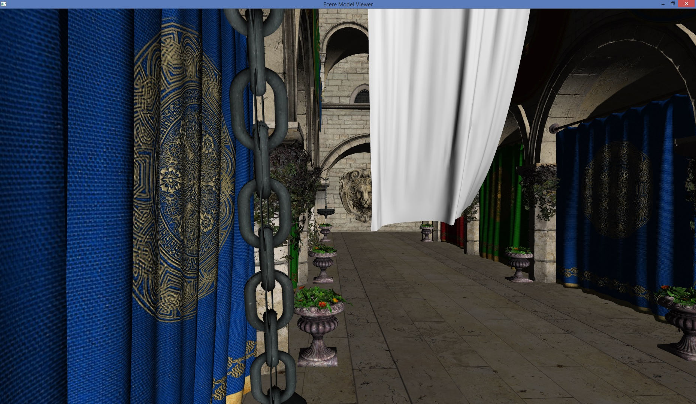

[reftext='{figure-caption} {counter:figure-num}']
.sponza.e3d (14.9 mb – with all textures embedded) -- Crytek Sponza Atrium from http://casual-effects.com/data/[Morgan McGuire's Computer Graphics Archive]
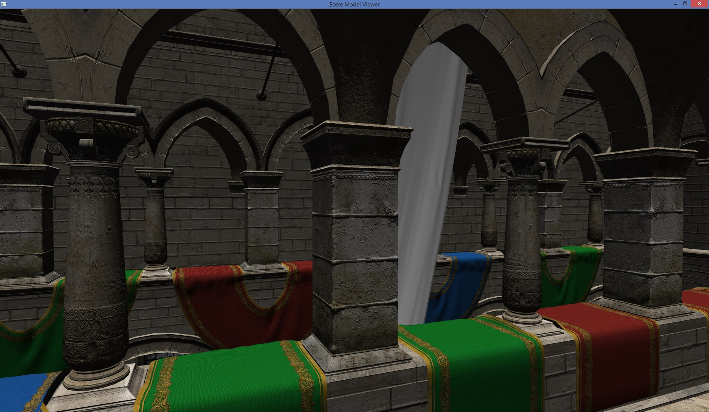

[reftext='{figure-caption} {counter:figure-num}']
.sponza.e3d (14.9 mb – with all textures embedded) -- Crytek Sponza Atrium from http://casual-effects.com/data/[Morgan McGuire's Computer Graphics Archive]
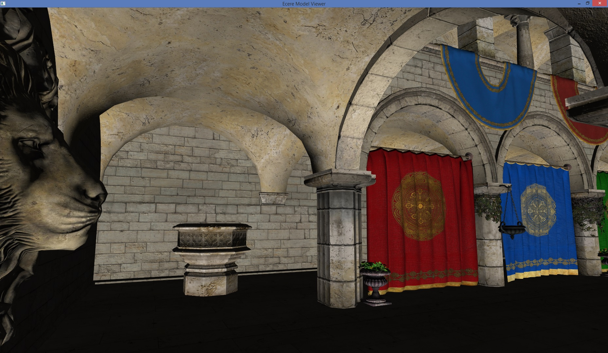

NOTE: PBR (Physically Based Rendering) textures for Sponza Atrium available from +
http://www.alexandre-pestana.com/pbr-textures-sponza/

[reftext='{figure-caption} {counter:figure-num}']
.sibenik.e3d (880 kb) -- Sibenik Cathedral from http://casual-effects.com/data/[Morgan McGuire's Computer Graphics Archive]
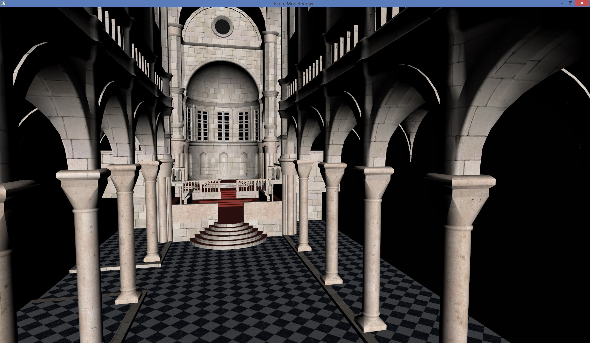

[reftext='{figure-caption} {counter:figure-num}']
.conference.e3d (1.61 mb) -- Conference Room from http://casual-effects.com/data/[Morgan McGuire's Computer Graphics Archive]
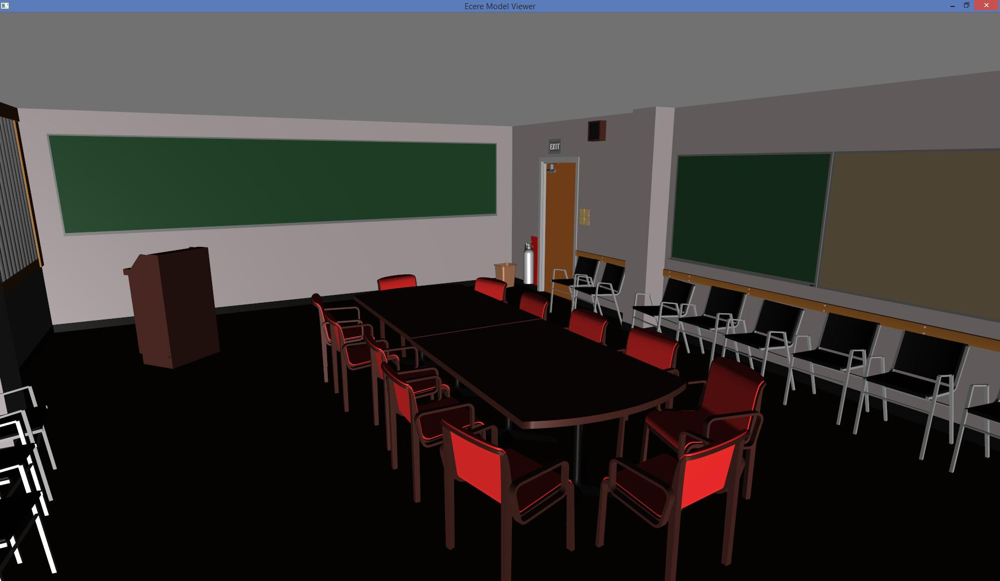

[reftext='{figure-caption} {counter:figure-num}']
.fireplace.e3d (2.44 mb) -- Conference Room from http://casual-effects.com/data/[Morgan McGuire's Computer Graphics Archive]
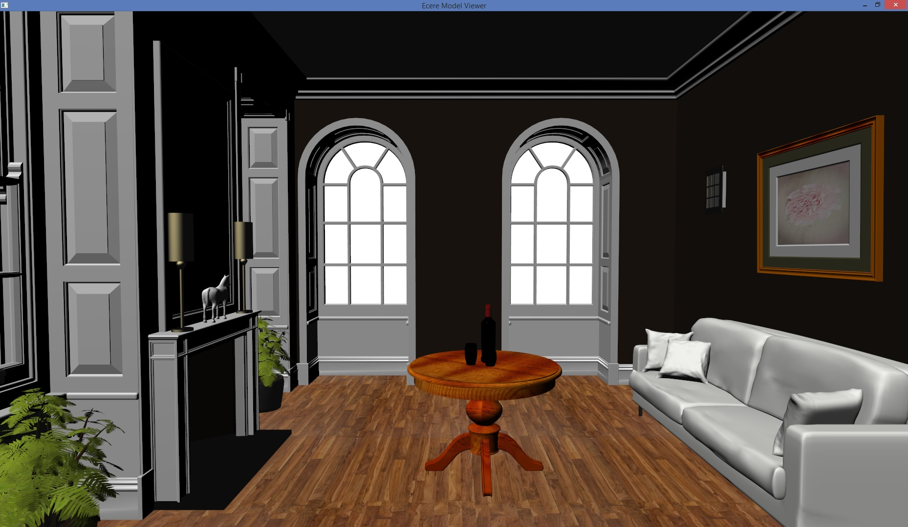

[reftext='{figure-caption} {counter:figure-num}']
.bedroom.e3d (21.9 mb) -- Bedroom from http://casual-effects.com/data/[Morgan McGuire's Computer Graphics Archive]
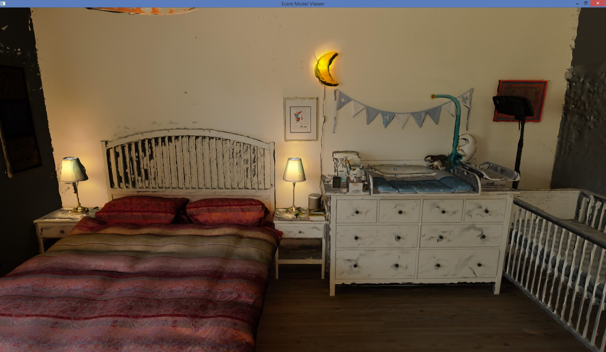
